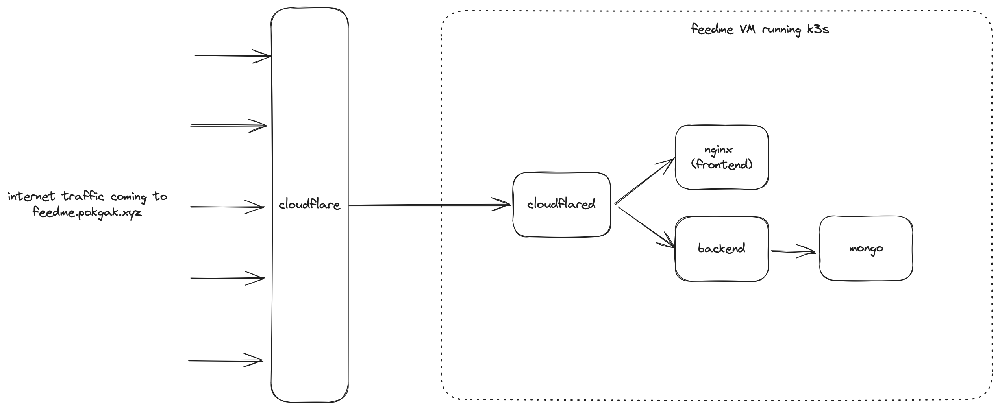

# DESIGN

* application is accessible from the internet at URL: https://feedme.pokgak.xyz
* k3s cluster running inside a VM on my home server
    - main reason is to save costs to not pay cloud providers for kubernetes service
    - hosting locally is good enough for this use case which is just a demo
    - for production, i would not recommend hosting locally as the reliability and high-availabilty is not guaranteed
* frontend, backend, and mongodb are hosted inside the k3s cluster
* cloudflare-tunnel is used for enabling traffic from the internet to reach the services running inside the k3s cluster in my private network
    * traffic from the internet goes through cloudflare and routed to cloudflare tunnel hosted inside the tunnel by DNS
    * all traffic to feedme.pokgak.xyz will be directed to the cloudflare-tunnel broker running inside the k3s cluster
* observability: added OpenTelemetry libraries on the backend to enable traces and sending traces to Baselime
    * tested hosting Grafana + Tempo inside the cluster and it worked but grafana UX for browsing traces is bad IMO
    * metrics and logs can also be send to Baselime or self-hosted inside the cluster using Prometheus and Loki
